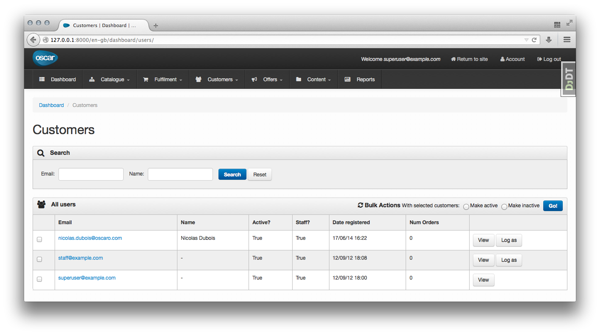

========================
django-oscar-impersonate
========================

:Info: Wrapper of django-impersonate for django-oscar
:Version: 0.0.1-alpha
:Author: Nicolas Dubois <nicolas.c.dubois@gmail.com>

Dependencies
============

* It was written for Python 3.3+ and Django 1.6+
* It depends on your project using the ``django.contrib.session`` framework
    (requirement from ``django-impersonate``)

Installation
============

.. code::

    $ pip install django-oscar-impersonate

Use
===

**``django-oscar-impersonate`` relies on ``django-impersonate``** (which is installed )

1. Add ``impersonate`` to your ``INSTALLED_APPS``.

.. code:: python

    INSTALLED_APPS = (
        # …
        'impersonate',
    )

2. Add both ``django-impersonate`` and ``django-oscar-impersonate`` middlewares
    (``django-impersonate``'s must be declared before ``django-oscar-impersonate``s)

.. code:: python

    MIDDLEWARE_CLASSES = (
        # …
        'impersonate.middleware.ImpersonateMiddleware',
        'oscar_impersonate.middleware.OscarImpersonateMiddleWare',
    )

3. Add ``django-impersonate`` URLs

.. code:: python

    urlpatterns = patterns('',
        # …
        url(r'^impersonate/', include('impersonate.urls')),
        # …
    )

4. Add ``OSCAR_IMPERSONATE_TEMPLATE_DIRS`` to ``TEMPLATE_DIRS``, before Oscar's.

.. code:: python

    from oscar import OSCAR_MAIN_TEMPLATE_DIR
    from oscar_impersonate import OSCAR_IMPERSONATE_TEMPLATE_DIR

    TEMPLATE_DIRS = (
        location('templates'),
        OSCAR_IMPERSONATE_TEMPLATE_DIR,
        OSCAR_MAIN_TEMPLATE_DIR,
    )

Functionality and custom settings
=================================

Dashboard
---------

``django-oscar-impersonate`` adds a “Log as” button on customers' dashboard:

When a staff member impersonates a customer, a button appears to stop impersonification.

.. image:: docs/_static/images/screenshot-dashboard-customer-list-impersonification.png
    :alt: Customer dashboard with ”Stop impersonification” button

Toolbar
-------

When a staff member impersonates a customer, a small toolbar appears at the top to display who
is impersonated

.. image:: docs/_static/images/screenshot-sandbox-homepage-impersonification.png
    :alt: Homepage from Oscar sandbox

Other
-----

For other features and custom settings, please check ``django-impersonate``'s docs.

License
=======

BSD License
